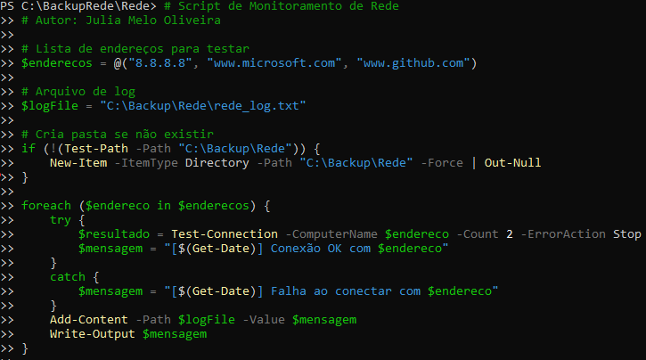
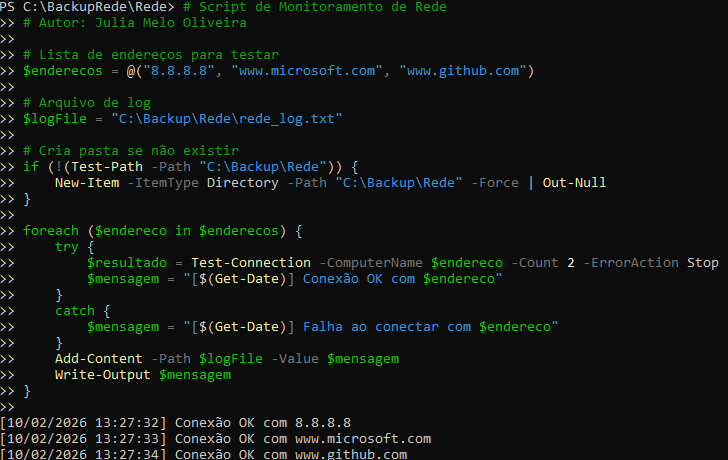
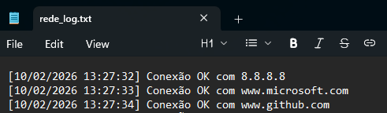

#  >> Projeto de Diagnóstico de Rede em PowerShell

Este projeto é um script simples em PowerShell para verificar a conectividade com servidores e sites importantes.  
Ele registra os resultados em um arquivo de log, permitindo análise posterior de falhas de rede.

---

## >> Objetivo
- Diagnosticar rapidamente problemas de rede.
- Automatizar testes de conectividade.
- Criar histórico de execuções em log.

---

## >> Como usar
1. Crie uma pasta para armazenar os resultados:
   - Exemplo: `C:\BackupRede\Rede`
2. Ajuste a lista de endereços no script (`$enderecos`).
3. Execute o script:
   ```powershell
   .\network_check.ps1
4. Os resultados serão gravados em rede_log.txt

## Exemplo de execução




